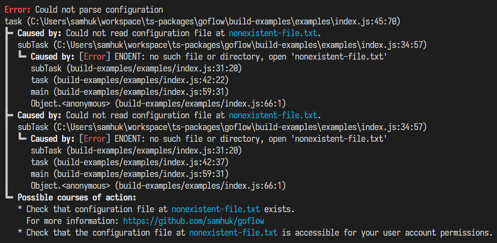

<h1 align="center">GoodFlow</h1>
<p align="center">
  <em>Improve how you do Javascript errors</em>
</p>

<p align="center">
  <a href="https://img.shields.io/badge/License-MIT-green.svg" target="_blank">
    
  </a>
  <a href="https://badge.fury.io/js/good-flow.svg" target="_blank">
    
  </a>
</p>

## Overview

GoodFlow improves how you do errors in Javascript:
* Emit and handle errors in a flat, Go-like way, avoiding endless nested try-catch blocks and use of mutable `let` variables.
* Nest errors with inner errors to attach informative context.
* Print errors to console beautifully.

## Usage

```typescript
import { createGFError, GFResult } from 'good-flow'

const task = (path: string): GFResult<string> => {
  try {
    return [fs.readFileSync(path, { encoding: 'utf8' }), null]
  }
  catch (e: any) {
    return [undefined, createGFError({
      msg: c => `Could not read file at ${c.cyan(path)}.`,
      inner: e,
    })]
  }
}

const [taskResult, err] = task() // Go-like structure
if (err != null) {
  console.log(err.toLogString()) // Log error (including, recursively, any of it's inner errors)
  exit(1)
}

exit(0)
```

## Logging

Use `GFError.toLogString` to serialize a GoodFlow error to a console-loggable string. A preview of this output for a relatively complex error:



## Development

See [./contributing/development.md](./contributing/development.md)

---

If you found this package delightful, feel free to [buy me a coffee](https://www.buymeacoffee.com/samhuk) ✨
